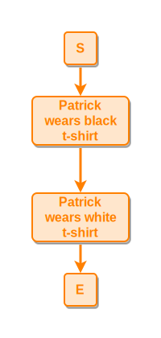
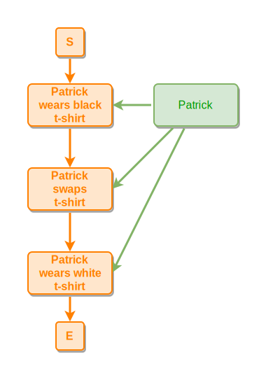
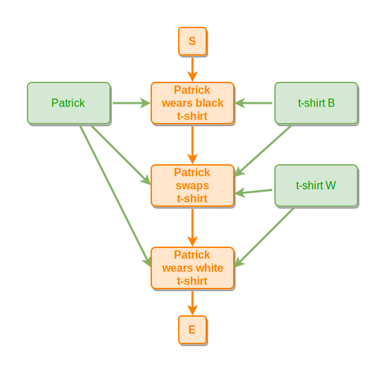
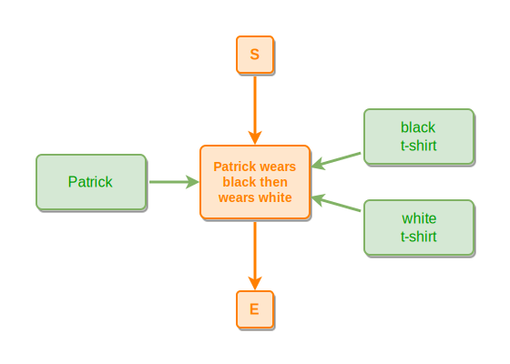
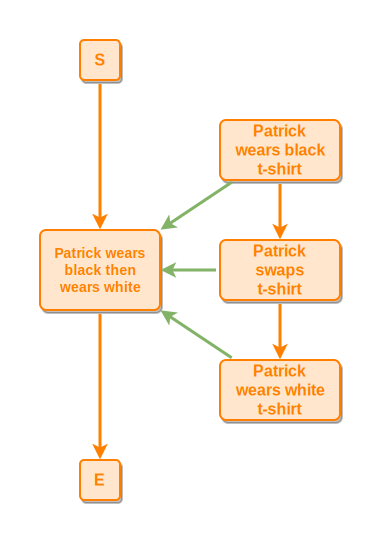
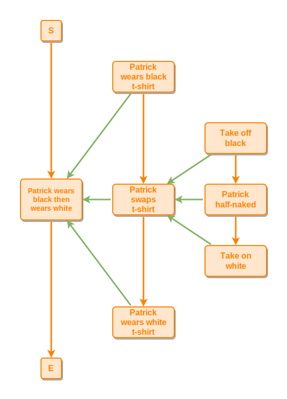
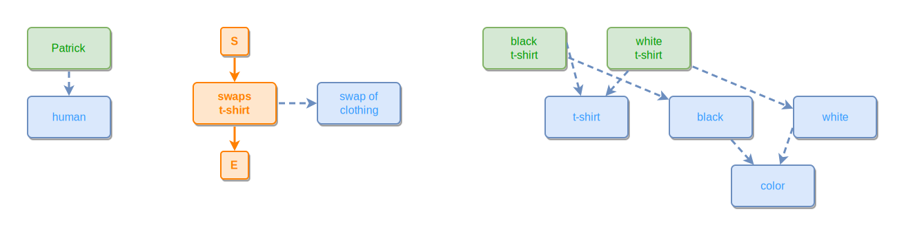
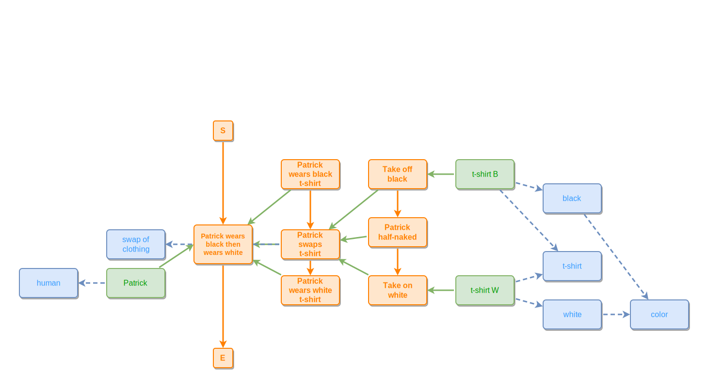
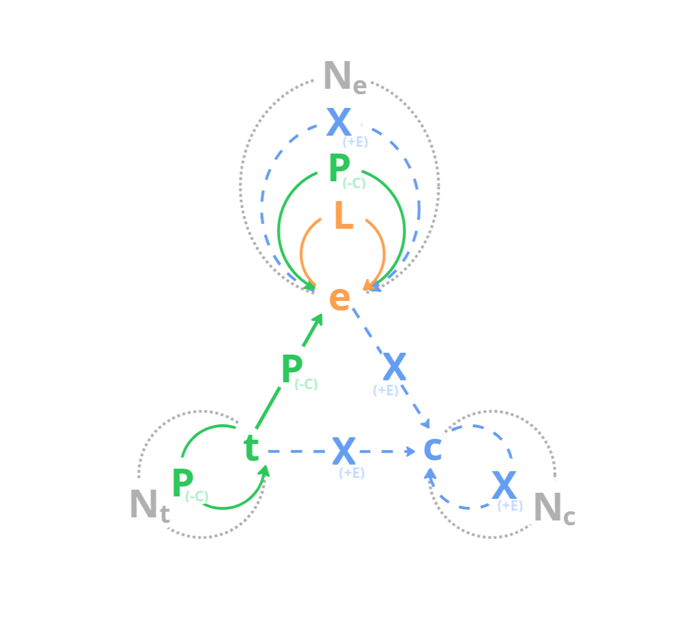

# infinite.pm

A newcomer's introduction to [**infinite.pm**](https://infinite.pm) — Infinite Process Modeling (**ipm**, also written **IPM**).

_"The universe is made of stories, not of atoms."_ – Muriel Rukeyser

## What is infinite.pm?

**infinite.pm** is a way to model processes, stories, and systems as readable graphs. It is an experiment in applying Mark Burgess's [Semantic Spacetime γ(3,4)](https://semantic.st/) (**SST**) representation — to everyday modeling work and software engineering.

Mark Burgess's insight, and the foundation of γ(3,4): with just **three kinds of nodes** and **four kinds of edges**, you can sketch (in our reading) *any observer's view of anything* in space and time — a process, a story, a system, life, the universe, and everything.

**Where this is going.** The infinite.pm project is an **experiment** in **Semantic Spacetime-based modeling and cooperation** between agents. **Smart agents** like humans, AI agents, and smart machines assess promises made by other agents, stigmergic trails, tools, and things — to explore, evolve, and endure. The aim is to help us *externalize* our mental models in the form of ipm stories/processes/loops, **think with them as a partner** (in the spirit of Niklas Luhmann's [Zettelkasten](https://en.wikipedia.org/wiki/Zettelkasten)), and gradually integrate them into **one living graph**. The medium we are aiming at: the [infinite canvas](https://infinitecanvas.tools/).

**Tooling.** Today there is a VS Code extension for live editing and preview of `ipmt` (the infinite.pm text format for these graphs), plus a small renderer that compiles ipmt fenced blocks into the SVG diagrams you see throughout this README. [mj41](https://mj41.cz/) is prototyping these (**spec-driven/vibe-coded**) and will open-source them over time as they stabilize. [Sponsors](https://github.com/sponsors/mj41) — AI-token kind or life kind — are always welcome; both speed this up a bit.

## The three node kinds

| Kind | Symbol | What it is | Examples |
| --- | :---: | --- | --- |
| <!--ipmt:as-token:e-title-->`Event` | <!--ipmt:as-token:e-marker-->`e` (<!--ipmt:as-token:e-title-->`orange`) | A transient happening — fast at the model's timescale | <!--ipmt:as-token:e-title-->`"User clicks button"`, <!--ipmt:as-token:e-title-->`"Build runs"`, <!--ipmt:as-token:e-title-->`"K8s service deploying"`, <!--ipmt:as-token:e-title-->`"Plum murders Scarlet"` |
| <!--ipmt:as-token:t-title-->`Thing` | <!--ipmt:as-token:t-marker-->`t` (<!--ipmt:as-token:t-title-->`green`) | A persistent participant — slow at the model's timescale | <!--ipmt:as-token:t-title-->`"Alice"`, <!--ipmt:as-token:t-title-->`"my laptop"`, <!--ipmt:as-token:t-title-->`"service A container"`, <!--ipmt:as-token:t-title-->`"knife K1"`, <!--ipmt:as-token:t-title-->`"Mrs. Scarlet"`, <!--ipmt:as-token:t-title-->`"Prof. Plum"` |
| <!--ipmt:as-token:c-title-->`Concept` | <!--ipmt:as-token:c-marker-->`c` (<!--ipmt:as-token:c-title-->`blue`) | A quasi-invariant pattern; a property that events or things can express | <!--ipmt:as-token:c-title-->`"human"`, <!--ipmt:as-token:c-title-->`"microservice"`, <!--ipmt:as-token:c-title-->`"production environment"`, <!--ipmt:as-token:c-title-->`"murder"` |

Rule of thumb, in order:

1. *Is something happening here, at the timescale I care about?* → <!--ipmt:as-token:e-marker-->`event`
2. *Does it persist with stable identity while its state changes?* → <!--ipmt:as-token:t-marker-->`thing`
3. *Does it stay the same across all events and things that express it?* → <!--ipmt:as-token:c-marker-->`concept`

<!--ipmt:as-token:t-title-->`A thing` isn't literally static — it's *slow enough* at the chosen timescale that you can treat it as unimportant for the model's purpose. A laptop is <!--ipmt:as-token:t-title-->`a thing` inside a "type a doc" <!--ipmt:as-token:e-title-->`event`; the laptop *is* <!--ipmt:as-token:e-title-->`an event chain` if you zoom out to its whole lifetime, from purchase to retirement. Pick the scale first, then split <!--ipmt:as-token:e-title-->`fast/dynamic` and <!--ipmt:as-token:t-title-->`slow/static`.

### Every model has a purpose

> *A model is a simplified representation of something for a purpose.* — Joshua Spodek, *Leadership Step by Step*, via [mj41 — my mental models](https://blog.mj41.cz/my-mental-models-83adc08d648b)

The purpose decides what goes in and — equally important — what stays out. *"What is not in the scope of your model has the same importance as what is in the scope."* A map of the Czech Republic for *"where is it on a globe?"* looks nothing like a map for *"where is the nearest bakery?"* Both are good models if the purpose is clear; both are useless if the purpose is the other one.

Before you start creating an infinite.pm graph, decide what **question** or **purpose** this model/view is going to answer. That decides which events, things, and concepts belong in it, and which would just be noise.

### Every model is an observer's account

There is no view-from-nowhere. An ipm graph is always **someone's** account of a slice of the world — what *they* saw, at *their* chosen timescale, with *their* chosen boundary. This matters most for concepts: deciding that <!--ipmt-->`swap t-shirt ::e` expresses <!--ipmt-->`swap of clothing ::c` rather than <!--ipmt-->`magic trick ::c` is in the eye of the beholder. Two honest observers can produce two different but non-contradictory models of the same scene. Combined with a shared collection of models, infinite.pm tools can surface views and beliefs you missed.

## Build it up — by example

We'll model the same tiny scene step by step: *Patrick swaps a black t-shirt for a white one.*

### Step 1 — just an event chain

Start with the activity. Events lead to other events.

```ipmt
Patrick wears black t-shirt ::e
  --> Patrick wears white t-shirt ::e
```
<!-- ipm-svg id=01 hash=0183bb61 -->



The arrow <!--ipmt:as-token:L-->`-->` between two events means <!--ipmt:as-token:L-->`leads-to` (rendered as an <!--ipmt:as-token:L-->`orange arrow`) — temporal/causal flow. <!--ipmt:as-token:e-marker-->`::e` marks each node as an event. The chain shows only what the observer *directly saw*: two wear states. Step 2 onward adds a <!--ipmt:as-token:e-title-->`swap` event between them — a *hypothesized* middle step the observer didn't witness.

### Step 2 — add a participant (thing → event)

Thing <!--ipmt:as-token:t-title-->`Patrick` is *in* every event. A thing participates in an event by being <!--ipmt:as-token:P-->`part of` it — a **spatial** containment relation (the thing sits inside the event's region of space and time), rendered as a <!--ipmt:as-token:P-->`green arrow`.

```ipmt
Patrick wears black t-shirt ::e wearB::a
  --> Patrick swaps t-shirt ::e swapT::a
  --> Patrick wears white t-shirt ::e wearW::a

Patrick --> wearB, swapT, wearW
```
<!-- ipm-svg id=02 hash=036d9600 -->


Two new tricks:

- Here, <!--ipmt:as-token:e-alias-->`wearB`<!--ipmt:as-token:type-marker-->`::a` is an **alias** — a short stable name for the long event title.
- The <!--ipmt-->`Patrick --> wearB, swapT, wearW` line fans out: one source, three targets.

Unmarked nodes default to **things**. The arrow goes <!--ipmt:as-token:P-->`from the thing to the event` — <!--ipmt:as-token:t-title-->`the thing` is <!--ipmt:as-token:P-->`part of` <!--ipmt:as-token:e-title-->`the event`, never the other way around (a modeling rule, not a syntactic accident).

**Add the t-shirts as participants too.** <!--ipmt:as-token:t-title-->`The black t-shirt` is worn in <!--ipmt:as-token:e-title-->`wearB` and is still on Patrick (briefly) during <!--ipmt:as-token:e-title-->`swapT`; <!--ipmt:as-token:t-title-->`the white t-shirt` enters at <!--ipmt:as-token:e-title-->`swapT` and stays on through <!--ipmt:as-token:e-title-->`wearW`. Each thing attaches to the events where it actually appears.

```ipmt
Patrick wears black t-shirt ::e wearB::a
  --> Patrick swaps t-shirt ::e swapT::a
  --> Patrick wears white t-shirt ::e wearW::a

Patrick --> wearB, swapT, wearW

black t-shirt --> wearB, swapT
white t-shirt --> swapT, wearW
```
<!-- ipm-svg id=03 hash=ba3e167d -->


**You can also zoom *out*.** The same scene can be told at a coarser level: one single event that names only the *observable* change (Patrick wore black, then white), with every participant attached at that one level. The mechanism — *how* he changed t-shirts — is hidden inside the wrapper event and revealed only when you zoom in.

```ipmt
Patrick wears black then wears white ::e wearBW::a

Patrick    --> wearBW
black t-shirt  --> wearBW
white t-shirt  --> wearBW
```
<!-- ipm-svg id=04 hash=2e16c454 -->


Same story, different zoom level. The right level depends on the **purpose** of your model — and you don't have to pick just one.

Going the other direction, **zoom in**: replace a coarse event with its sub-events. The next two diagrams show pure *event structure* — no participants, no concepts — so the zoom move stands on its own. First, drill into <!--ipmt:as-token:e-title-->`wearBW` and show its three mid-level sub-events as a leads-to chain, each part-of the parent:

```ipmt
Patrick wears black then wears white ::e wearBW::a

Patrick wears black t-shirt ::e wearB::a
  --> Patrick swaps t-shirt ::e swapT::a
  --> Patrick wears white t-shirt ::e wearW::a

wearB --::P--> wearBW
swapT --::P--> wearBW
wearW --::P--> wearBW
```
<!-- ipm-svg id=05 hash=119e8e54 -->



We can keep going — <!--ipmt:as-token:e-title-->`swapT` itself decomposes into a finer chain of moments. Here are both zoom levels at once, three levels of pure event nesting:

```ipmt
Patrick wears black then wears white ::e wearBW::a

Patrick wears black t-shirt ::e wearB::a
  --> Patrick swaps t-shirt ::e swapT::a
  --> Patrick wears white t-shirt ::e wearW::a

wearB, swapT, wearW --::P--> wearBW

Take off black ::e takeOff::a       --::P--> swapT
Patrick half-naked ::e halfNaked::a --::P--> swapT
Take on white ::e takeOn::a         --::P--> swapT

takeOff --> halfNaked --> takeOn
```
<!-- ipm-svg id=06 hash=01228d05 -->



Step 4 will bring Patrick, the t-shirts, and the concepts back into this nested structure.

### Step 3 — give a property with a concept

What *properties* does Patrick express? What *property* does the swap event express? Each concept names a single, independent property.

```ipmt
Patrick --> human ::c

swaps t-shirt ::e --> swap of clothing ::c

black t-shirt --> t-shirt ::c, black ::c
white t-shirt --> t-shirt ::c, white ::c
black ::c, white ::c --> color ::c
```
<!-- ipm-svg id=07 hash=559e2d8f -->



Writing <!--ipmt:as-token:c-marker-->`::c` marks the node as a concept. The arrow <!--ipmt-->`thing A --> cX ::c` (<!--ipmt:as-token:E-->`an expresses arrow`, rendered <!--ipmt:as-token:E-->`blue dashed`) reads as "the thing <!--ipmt:as-token:E-->`expresses property` <!--ipmt:as-token:c-title-->`cX`" — and <!--ipmt-->`event e1 ::e --> cY ::c` reads the same way for an event. A node can have several such arrows, one per property; this is **not** isa / classification — each concept is one promise the node makes, not a slot in a taxonomy. Patrick can express <!--ipmt-->`human ::c`, <!--ipmt-->`tall ::c`, and <!--ipmt-->`colleague ::c` simultaneously without any of those being his "type".

A concept is what stays the same across all events and things that express it — what Mark Burgess calls a **quasi-invariant pattern**. The patterns are out there in the scene, but **which patterns the observer names** is a choice, not a fact about the world: Mark writes that "there is no universal set of concepts to subdivide knowledge … these are merely ad hoc ways of spanning a collection of connected ideas, chosen by convention or happenstance" ([Avoiding the Ontology Trap](https://medium.com/@mark-burgess-oslo-mb/avoiding-the-ontology-trap-how-biotech-shows-us-how-to-link-knowledge-spaces-654bcbb9122a)). Two honest observers can carve the same scene into different — and equally valid — concept vocabularies; writing <!--ipmt-->`swap of clothing ::c` is the modeler saying *this is the pattern I noticed and chose to name*.

### Step 4 — bring it together, with a parent event

The full story is now the **strict composition of the earlier steps**: the three-level event tree from Step 2's last diagram (top <!--ipmt:as-token:e-title-->`wearBW`, mid-level wear → swap → wear, inner take-off → half-naked → take-on), the **things from Step 2** (Patrick, both t-shirts) attached at the same levels they appeared, and the **concepts from Step 3** (<!--ipmt-->`human ::c`, <!--ipmt-->`swap of clothing ::c`). Part-of transitivity carries Patrick into every sub-event automatically, so we attach him only at the top.

```ipmt
Patrick wears black then wears white ::e wearBW::a

Patrick wears black t-shirt ::e wearB::a
  --> Patrick swaps t-shirt ::e swapT::a
  --> Patrick wears white t-shirt ::e wearW::a

wearB, swapT, wearW --::P--> wearBW

Take off black ::e takeOff::a       --::P--> swapT
Patrick half-naked ::e halfNaked::a --::P--> swapT
Take on white ::e takeOn::a         --::P--> swapT
takeOff --> halfNaked --> takeOn
swapT --> swap of clothing ::c

Patrick --> wearBW, human ::c
black t-shirt --> takeOff
white t-shirt --> takeOn

black t-shirt --> t-shirt ::c, black ::c
white t-shirt --> t-shirt ::c, white ::c
black ::c, white ::c --> color ::c
```
<!-- ipm-svg id=08 hash=9fab3bdb -->


That's a complete ipmt model: <!--ipmt:as-token:e-title-->`events` <!--ipmt:as-token:L-->`lead to`  <!--ipmt:as-token:e-title-->`events`,  <!--ipmt:as-token:t-title-->`things`  <!--ipmt:as-token:P-->`participate in`  <!--ipmt:as-token:e-title-->`events`,  <!--ipmt:as-token:t-title-->`things` and  <!--ipmt:as-token:e-title-->`events`  <!--ipmt:as-token:X-->`express`  <!--ipmt:as-token:c-title-->`concepts` as properties, and  <!--ipmt:as-token:c-title-->`concepts` can themselves  <!--ipmt:as-token:X-->`express properties` of other  <!--ipmt:as-token:c-title-->`concepts`.

**Spacetime, made explicit.** The leads-to chain is *time*; the part-of containment is *space*. Mark Burgess puts it directly: an event is *"any region of space and time"* — a slice of the world where **things and ideas come together for a while** (his phrase is "occurrences of things and ideas together in time"). The parent event <!--ipmt:as-token:e-title-->`wearBW` is one such region — it holds Patrick (the slow worldline) for its whole duration; each sub-event is a smaller spacetime region nested inside it, where faster things (specific t-shirts being worn or swapped) come and go. Concepts (<!--ipmt-->`human ::c`, <!--ipmt-->`color ::c`) sit *outside* spacetime entirely — they are invariant patterns the events and things express, the same in every frame.

**Zoom out far enough, and "things" become events too.** At the timescale of the swap, each t-shirt is a stable thing. Zoom out to the t-shirt's whole life — manufactured, bought, worn through hundreds of days, washed many times, eventually torn, thrown away (or perhaps given a second life as a rag) — and that *thing* is itself an event chain on its own worldline. Patrick, zoomed out to his whole life, is the same: born, grows up, swaps many t-shirts, and eventually dies. The thing/event split is **not** a property of the world; it is a property of the **scale you chose** to model at. Every "thing" is a slow process; every "event" is a process you decided to look at closely.

**An alternative, fuller worked example** of the same scene — with two different observer accounts of the swap (one exchange, one layered black-over-white), a deeper zoom into the swap itself, *open-world* probe events that decide which observation actually happened, and small color and clothing taxonomies — is in [`docs/examples/tshirt-magic.md`](docs/examples/tshirt-magic.md). Same building blocks; more depth.

## The four edge kinds



The triangle is  <!--ipmt:as-token:e-marker-->`e` (<!--ipmt:as-token:e-title-->`event`), <!--ipmt:as-token:t-marker-->`t` (<!--ipmt:as-token:t-title-->`thing`), and <!--ipmt:as-token:c-marker-->`c` (<!--ipmt:as-token:c-title-->`concept`). The arrows and self-loops show every legal edge. The dotted circles (<!--ipmt:as-token:N-->`N`ₑ, <!--ipmt:as-token:N-->`N`ₜ, <!--ipmt:as-token:N-->`N`𞁞) are <!--ipmt:as-token:N-->`NEAR` — similarity between two nodes of the same kind, undirected.

The edge symbols <!--ipmt:as-token:L-->`L` / <!--ipmt:as-token:P-->`P` / <!--ipmt:as-token:X-->`X` / <!--ipmt:as-token:N-->`N` are IPM's mnemonic; Burgess's original SST uses <!--ipmt:as-token:L-->`L` / <!--ipmt:as-token:P-->`C` / <!--ipmt:as-token:X-->`E` / <!--ipmt:as-token:N-->`N`. For why IPM renames <!--ipmt:as-token:P-->`C` → <!--ipmt:as-token:P-->`P` (and reverses its direction) and <!--ipmt:as-token:X-->`E` → <!--ipmt:as-token:X-->`X`, see [`docs/ipm-vs-sst.md`](docs/ipm-vs-sst.md).

| Symbol | Color | Name | Meaning | When to use |
| :---: | --- | --- | --- | --- |
| <!--ipmt:as-token:L-->`L` | <!--ipmt:as-token:L-->`orange` | <!--ipmt:as-token:L-->`LEADS-TO` | Temporal / causal flow | One event causes or precedes another |
| <!--ipmt:as-token:P-->`P` | <!--ipmt:as-token:P-->`green` | <!--ipmt:as-token:P-->`PART-OF` | Containment / participation | A thing is inside an event, a sub-event is inside a parent event, or a sub-part is inside a bigger thing |
| <!--ipmt:as-token:X-->`X` | <!--ipmt:as-token:X-->`blue dashed` | <!--ipmt:as-token:X-->`EXPRESSES` | Property (a single promise) | An event or thing expresses a concept as a property; a concept itself can express another concept the same way. Not is-a — a node can express many independent properties |
| <!--ipmt:as-token:N-->`N` | <!--ipmt:as-token:N-->`gray dotted` | <!--ipmt:as-token:N-->`NEAR-TO` | Similarity / proximity (undirected) | Two same-kind nodes are alike but you do not want to merge them |

## All allowed edges

Every legal source → target combination, matching the diagram above. The "ipmt syntax" column shows the most common form for each edge.

| # | Source → Target | Edge | ipmt syntax | Reads as |
|:-:|:--|:-:|:--|:--|
| 1 | event → event | L | <!--ipmt-->`e1 ::e --> e2 ::e` | e1 leads to e2 |
| 2 | event → event | P | <!--ipmt-->`inner ::e --::P--> outer ::e` | inner event is part of outer event |
| 3 | event → event | X | <!--ipmt-->`e1 ::e --::X--> e2 ::e` | e1 expresses e2 |
| 4 | event — event | N | <!--ipmt-->`e1 ::e --- e2 ::e` | e1 is similar to e2 (and vice versa) |
| 5 | thing → event | P | <!--ipmt-->`tA --> e1 ::e` | tA participates in (is part of) e1 |
| 6 | thing → thing | P | <!--ipmt-->`subpart --> whole` | subpart is part of the whole (physical composition) |
| 7 | thing — thing | N | <!--ipmt-->`tA --- tB` | tA is near / similar to tB (and vice versa) |
| 8 | event → concept | X | <!--ipmt-->`e1 ::e --> cX ::c` | e1 expresses property cX |
| 9 | thing → concept | X | <!--ipmt-->`tA --> cX ::c` | tA expresses property cX |
| 10 | concept → concept | X | <!--ipmt-->`cX ::c --> cY ::c` | cX expresses property cY |
| 11 | concept — concept | N | <!--ipmt-->`cX ::c --- cY ::c` | cX is similar to cY (and vice versa) |

Two important rules baked into this table:

- **No `thing --> thing` arrow except part-of.** To say "Alice owns the car" or "Mike uses his phone," create an **event** — a region of spacetime that co-locates both participants for some duration — and let it express the relation as a concept-property (<!--ipmt-->`Ownership ::c`, <!--ipmt-->`Uses ::c`). This is SST's general handling of arbitrary binary relations: the event is the *temporal* container that brings the two things together; the concept on the event names what that co-location *means*. There is no direct `thing --uses--> thing` edge.
- **The bare `-->` arrow defaults to the relation that fits the two node kinds** <!--ipmt:as-token:L-->`leads-to` for <!--ipmt:as-token:e-title-->`event`-to-<!--ipmt:as-token:e-title-->`event`, <!--ipmt:as-token:P-->`part-of` for <!--ipmt:as-token:t-title-->`thing`-to-<!--ipmt:as-token:e-title-->`event` and <!--ipmt:as-token:t-title-->`thing`-to-<!--ipmt:as-token:t-title-->`thing`, <!--ipmt:as-token:X-->`expresses` for <!--ipmt:as-token:e-title-->`event`-to-<!--ipmt:as-token:c-title-->`concept`, <!--ipmt:as-token:t-title-->`thing`-to-<!--ipmt:as-token:c-title-->`concept` and <!--ipmt:as-token:c-title-->`concept`-to-<!--ipmt:as-token:c-title-->`concept`. The explicit <!--ipmt:as-token:L-->`--::L-->`, <!--ipmt:as-token:P-->`--::P-->`, <!--ipmt:as-token:X-->`--::X-->`, <!--ipmt:as-token:N-->`--::N--` forms are documented in the ipmt syntax spec.

## Where to look next

**Worked examples in this repo:**

- [`docs/examples/murder-full.md`](docs/examples/murder-full.md) — a Clue-style murder narrative
- [`docs/examples/meta-ipm.md`](docs/examples/meta-ipm.md) — IPM modeling itself

**ipmt syntax spec:** the formal grammar of the text format — type markers, aliases, arrow forms, edge tooltips, escaping, fence behaviour — lives in a separate document that will be published alongside the open-source `ipm-tools` release. Until then, the build-up section above plus the worked examples in `docs/examples/` show the vocabulary that covers nearly every model in the wild.

External reading — Mark Burgess ([ResearchGate profile](https://www.researchgate.net/profile/Mark-Burgess-9)) on Semantic Spacetime γ(3,4):

- [Designing Nodes and Arrows in Knowledge Graphs with Semantic Spacetime](https://mark-burgess-oslo-mb.medium.com/designing-nodes-and-arrows-in-knowledge-graphs-with-semantic-spacetime-0992b9cae595) — the source article for the etc / LCEN triangle
- [Semantic Spacetime 1: The Shape of Knowledge](https://mark-burgess-oslo-mb.medium.com/semantic-spacetime-1-the-shape-of-knowledge-86daced424a5) — fast/slow variable separation, why a thing is a *worldline*
- [Knowledge Management series](https://mark-burgess-oslo-mb.medium.com/list/knowledge-management-da2834a25b99) — the full medium series
- [Agent Semantics, Semantic Spacetime, and Graphical Reasoning](https://arxiv.org/abs/2506.07756) — arxiv.org, June 2025; the academic write-up ([ResearchGate mirror](https://www.researchgate.net/publication/392507642_Agent_Semantics_Semantic_Spacetime_and_Graphical_Reasoning))
- [Smart Spacetime: How information challenges our ideas about space, time, and process](https://markburgess.org/smartspacetime.html) — Mark Burgess's book, the long-form treatment

## Related repos

All `infinite.pm` repositories live under the [`infinite-pm` GitHub org](https://github.com/orgs/infinite-pm/repositories).
