# ipmt syntax combinations

A combinatorial fixture for visual checks of the VS Code extension —
editor pane and markdown preview should color the same tokens the same
way. Cover the γ(3,4) SST table (3 node kinds × 4 relations) crossed
with the orthogonal syntax axes: with vs. without alias, with vs.
without tooltip, short vs. long arrow form, and (where applicable)
implicit vs. explicit type.

```
LPXN triangle:
  Leads-to (L) — orange, directed
  Part-of  (P) — green, directed
  eXpress  (X) — blue, directed (dashed)
  Near-to  (N) — gray, undirected (dotted)
```

The γ(3,4) type-pair table:

| Relation | Allowed type pairs                                           |
|----------|--------------------------------------------------------------|
| L        | event → event                                                |
| P        | event → event, thing → event, thing → thing                  |
| X        | event → concept, thing → concept, concept → concept          |
| N        | event — event, thing — thing, concept — concept (undirected) |

Each section below renders to a single SVG so per-pair colors land next
to each other in the preview.

A few syntax notes against the current parser:

- **Default node type is thing.** `::t` is optional — unmarked nodes
  are things. Events MUST carry `::e` and concepts MUST carry `::c`.
  So the "implicit type" axis only collapses when the node is a
  thing; LeadsTo (event → event) and any concept-typed node always
  need explicit markers.
- **Implicit relations via `-->`** — the parser infers the SST relation
  from the type pair. `thing --> event` is PartOf; `event --> concept`
  is Expresses; `concept --> concept` is Expresses. Only `event -->
  event` is LeadsTo. So `piece --> whole` (no markers) is thing →
  thing PartOf, **not** LeadsTo.
- **Inline `# comment`** on the same line as ipmt content is *not*
  supported — the `#` is taken as part of the node name. Put comments
  on their own line.
- **`--::P--"text"-->`** (explicit relation *with* edge tooltip) parses
  but folds `--::P` into the source node's name — don't combine the
  two. For an edge tooltip with PartOf / Expresses, drop the `::R`
  marker and let the type-pair inference do the work.
- **Near-to with tooltip** uses bare dashes on both sides:
  `--"text"--` (no `::N`).
- **`---` undirected shorthand** is accepted by the parser as Near-to
  for same-type pairs.
- **Mutual exclusivity (IPMV1.2)**: at most one SST edge per unordered
  pair of nodes. You cannot have both `A --::P--> B` and `B --::N-- A`.
- **Container boundary (IPMV2.8)**: if `A leads-to B` and `B` is
  `part-of` container `C`, then `A` must also be `part-of C` (or
  `leads-to C` to enter the container).

## 1. Leads-to (L)  — event → event

LeadsTo edges always need `::e` on both ends — no fully-implicit form
exists because the default type is thing. Without `::e` markers,
`e1 --> e2` parses as `thing → thing` and renders as PartOf (green),
not LeadsTo (orange).

### 1.1 Implicit `-->`, explicit `::e`

```ipmt
e1 ::e --> e2 ::e
```
<!-- ipm-svg id=01 hash=633ee46f -->
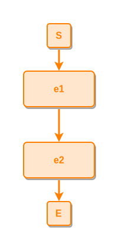

### 1.2 Long-form arrow `--::L-->`, explicit `::e`

```ipmt
e1 ::e --::L--> e2 ::e
```
<!-- ipm-svg id=02 hash=88412a1b -->


### 1.3 Reverse arrow `<--`, explicit `::e`

```ipmt
e2 ::e <-- e1 ::e
```
<!-- ipm-svg id=03 hash=36bce46c -->


### 1.4 With alias on both ends

```ipmt
shortA::a long event A ::e --> shortB::a long event B ::e
```
<!-- ipm-svg id=04 hash=b7f91f8a -->
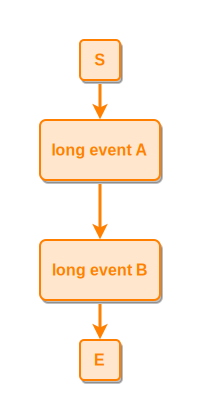

### 1.5 With edge tooltip `--"text"-->`

```ipmt
e1 ::e --"causes"--> e2 ::e
```
<!-- ipm-svg id=05 hash=bb71d4da -->
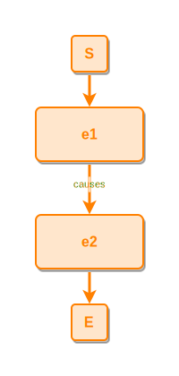

### 1.6 With node tooltips `::e "text" ::tip`

Canonical annotation order is `name ::type "tooltip" ::tip`.

```ipmt
e1 ::e "first happens" ::tip --> e2 ::e "then this" ::tip
```
<!-- ipm-svg id=06 hash=f30eb800 -->


### 1.7 Everything together — alias + node tooltip + edge tooltip

The `--::L-->` long form can't carry an edge tooltip cleanly (the
parser folds `--::L` into the source node name). Use bare `-->` plus
the edge tooltip — direction + relation are already implicit.

```ipmt
shortA::a long event A ::e "node tip A" ::tip --"causes"--> shortB::a long event B ::e "node tip B" ::tip
```
<!-- ipm-svg id=07 hash=13296ccc -->
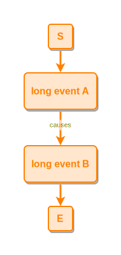

## 2. Part-of (P)

PartOf is the only relation where every node can stay implicit:
`thing → thing` with bare `-->` carries default types and an inferred
relation.

### 2.1 Implicit thing → thing — no type markers, no `::P`

Default-typed source and target, default arrow. The parser infers
PartOf from the `thing → thing` type pair.

```ipmt
piece --> whole
```
<!-- ipm-svg id=08 hash=99f55dba -->
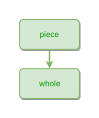

### 2.2 event → event, explicit `::P`

For event → event PartOf the explicit `--::P-->` is required;
otherwise bare `-->` would be inferred as LeadsTo.

```ipmt
inner ::e --::P--> outer ::e
```
<!-- ipm-svg id=09 hash=9ebf5118 -->
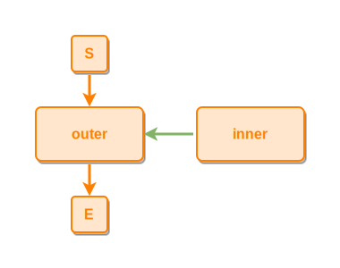

### 2.3 thing → event, with aliases

Bare `-->` between a thing and an event infers PartOf from the
type pair.

```ipmt
agentT::a actor agent --> actE::a some action ::e
```
<!-- ipm-svg id=10 hash=66caa707 -->
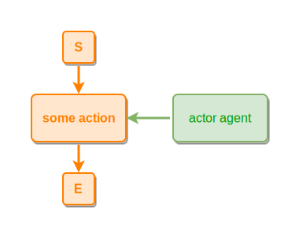

### 2.4 thing → thing, with edge tooltip

Bare `--"text"-->` between two things infers PartOf from the type
pair. The explicit `--::P--"text"-->` form folds `--::P` into the
source node's name, so don't combine `::P` with an edge tooltip.

```ipmt
piece --"belongs to"--> whole
```
<!-- ipm-svg id=11 hash=582ecb58 -->
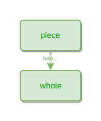

### 2.5 Reverse `<--::P--`, event → event (target on the left)

```ipmt
outer ::e <--::P-- inner ::e
```
<!-- ipm-svg id=12 hash=4eaff8f0 -->


### 2.6 With aliases and node tooltips, thing → thing

Long names with tooltips need explicit `::t` to mark where the
name ends.

```ipmt
shortP::a long piece ::t "fine-grained" ::tip --::P--> shortW::a long whole ::t "coarse" ::tip
```
<!-- ipm-svg id=13 hash=2baf4944 -->
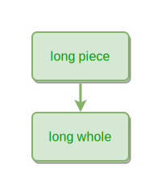

## 3. Expresses (X)

### 3.1 event → concept, explicit `::e` and `::c`

```ipmt
ev1 ::e --::X--> conceptA ::c
```
<!-- ipm-svg id=14 hash=303f6a8e -->
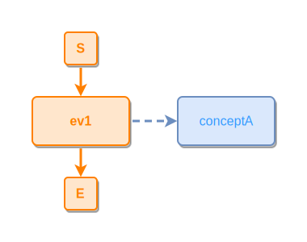

### 3.2 thing → concept, fully implicit source

Thing source can stay implicit; only the concept target needs `::c`.
Bare `-->` infers Expresses from the type pair.

```ipmt
thingT --> conceptC ::c
```
<!-- ipm-svg id=15 hash=adeba837 -->
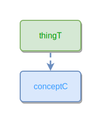

### 3.3 concept → concept

```ipmt
specificC ::c --::X--> generalC ::c
```
<!-- ipm-svg id=16 hash=8cc14b22 -->
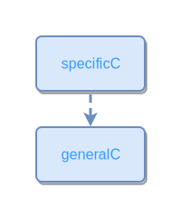

### 3.4 With alias on the source and tooltip on the concept

```ipmt
hShort::a long-form thing --::X--> color ::c "a concept" ::tip
```
<!-- ipm-svg id=17 hash=db58c450 -->
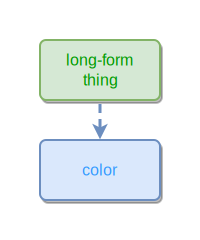

### 3.5 Reverse `<--::X--`, thing → concept

```ipmt
generalC ::c <--::X-- specificT
```
<!-- ipm-svg id=18 hash=08c65f6b -->
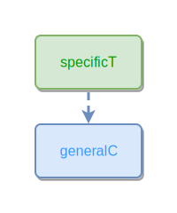

### 3.6 With edge tooltip — concept → concept

Bare `--"text"-->` between two concepts infers Expresses. Do not
combine `--::X--` with an edge tooltip (same node-name folding bug
as for `::P`).

```ipmt
red ::c --"is a"--> color ::c
```
<!-- ipm-svg id=19 hash=1d0f05db -->
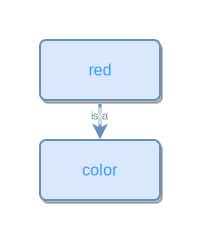

## 4. Near-to (N)  — undirected

### 4.1 event — event, explicit `::N`

```ipmt
ea ::e --::N-- eb ::e
```
<!-- ipm-svg id=20 hash=3e6cf7fe -->
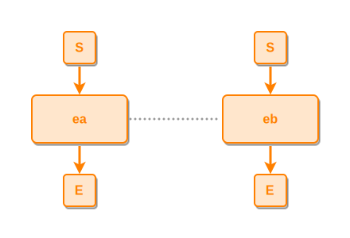

### 4.2 thing — thing, with aliases (implicit `::t`)

Thing default applies — no `::t` marker needed when there's no
tooltip to disambiguate.

```ipmt
shortA::a long thing A --::N-- shortB::a long thing B
```
<!-- ipm-svg id=21 hash=7a27f3ab -->


### 4.3 concept — concept, with node tooltips

```ipmt
hot ::c "high temperature" ::tip --::N-- cold ::c "low temperature" ::tip
```
<!-- ipm-svg id=22 hash=e50789c1 -->
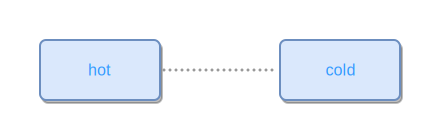

### 4.4 With edge tooltip, event — event

For Near-to with a tooltip, write the tooltip between bare dashes —
no `::N` marker. The parser infers Near-to from the undirected
shape `--…--`.

```ipmt
e1 ::e --"co-located"-- e2 ::e
```
<!-- ipm-svg id=23 hash=c6c328b7 -->
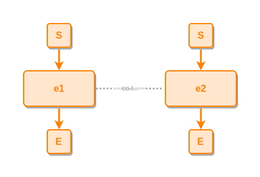

### 4.5 Bare `---` form (no explicit `::N`) — event — event

Some renderers accept `---` as Near-to shorthand. Editor + preview
should still color it as Near-to gray.

```ipmt
ea ::e --- eb ::e
```
<!-- ipm-svg id=24 hash=c48f317c -->


## 5. Markdown-only flourishes

Surrounding markdown — links, **bold**, *italic*, `inline code`, and
prose — should remain untouched by the ipmt-aware extension. Only the
fenced ` ```ipmt ` blocks above should pick up syntax colors.
