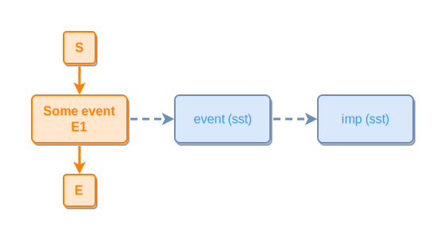
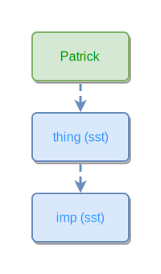
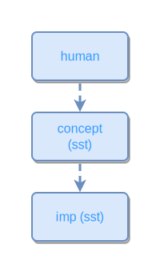

# Meta / Implicit

Every ipmt node has an implicit SST kind (event, thing, or concept). These snippets make that implicit kind explicit by pointing the node at its SST meta-concept and then at `imp (sst)` — the umbrella concept for "an instance of an SST primitive."

```ipmt
Some event E1 ::e --> event (sst) ::c --> imp (sst) ::c
```
<!-- ipm-svg id=01 hash=db2bf8bf -->


```ipmt
Patrick --> thing (sst) ::c --> imp (sst) ::c
```
<!-- ipm-svg id=02 hash=e9a72a13 -->


```ipmt
human ::c --> concept (sst) ::c --> imp (sst) ::c
```
<!-- ipm-svg id=03 hash=1166c012 -->

