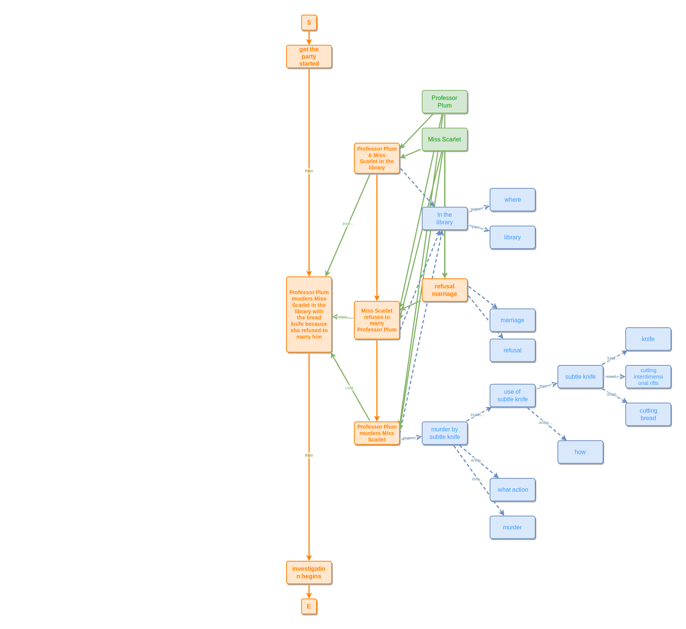

# Murder in the library

A Clue-style narrative modeled in ipmt: a party, a murder, and the investigation that follows. Shows how a top-level event (`murder-e`) decomposes into sub-events via part-of, how the same scene is re-located (`In the library`), and how a weapon's properties are expressed as a chain of concepts.

> **Based on Mark Burgess's Cluedo example** from [SSTorytime](https://github.com/markburgess/SSTorytime), discussed in [*Using Knowledge Graphs for Inferential Reasoning*](https://mark-burgess-oslo-mb.medium.com/using-knowledge-graphs-for-inferential-reasoning-8a06e583b4d4) (Article 8) and [*From Cognition to Understanding*](https://mark-burgess-oslo-mb.medium.com/from-cognition-to-understanding-677e3b7485de) (Article 14). Mark's original uses *Ms Scarlett*, *Martin*, and a *gun*; this version uses *Professor Plum*, *Miss Scarlet*, and a *bread knife* — the modeling shape (event-decomposes-into-sub-events, weapon-as-chain-of-concepts, participants-attached-via-part-of) is the same.

> **Syntax note.** This example uses **edge tooltips** — short annotations attached to each arrow, like `--"answers question"-->` and `<--::P involves--`. The README only teaches the bare arrow forms; edge tooltips are an additional ipmt feature covered in the (forthcoming) ipmt syntax spec.

```ipmt
get the party started ::e
  --then--> murder-e::a ::e Professor Plum murders Miss Scarlet in the library with the bread knife because she refused to marry him
  --then--> investigation begins ::e

murder-e <--::P involves-- library-ppms::a ::e Professor Plum & Miss Scarlet in the library
  --> In the library ::c
  --"answers question"--> where ::c

# "In the library" is the concept (::c); "library" is the abstract concept it expresses
In the library --"involves"--> library ::c

murder-e <--::P contains-- refusal-mspp::a ::e Miss Scarlet refuses to marry Professor Plum
  <--::P-- refusal-m::a ::e refusal marriage
  --> marriage ::c
refusal-m --> refusal ::c
refusal-mspp --> In the library

murder-e <--::P contains-- ppmms::a ::e Professor Plum murders Miss Scarlet
  --> In the library

ppmms --"example of"--> murder-sk::a ::c murder by subtle knife
  --"example of"--> use-sk::a ::c use of subtle knife
  --"involves"--> sk::a ::c subtle knife
  --"kind of"--> knife ::c

murder-sk --"answers question"--> what action ::c
murder-sk --"involves"--> murder ::c
use-sk --"answers question"--> how ::c
sk --"used for"--> cutting interdimensional rifts ::c
sk --"used for"--> cutting bread ::c

# leads-to ordering across the three sub-events of the murder
library-ppms --> refusal-mspp --> ppmms

Professor Plum --> library-ppms, refusal-mspp, refusal-m, ppmms
Miss Scarlet --> library-ppms, refusal-mspp, refusal-m, ppmms
```
<!-- ipm-svg id=01 hash=caa384f5 -->

