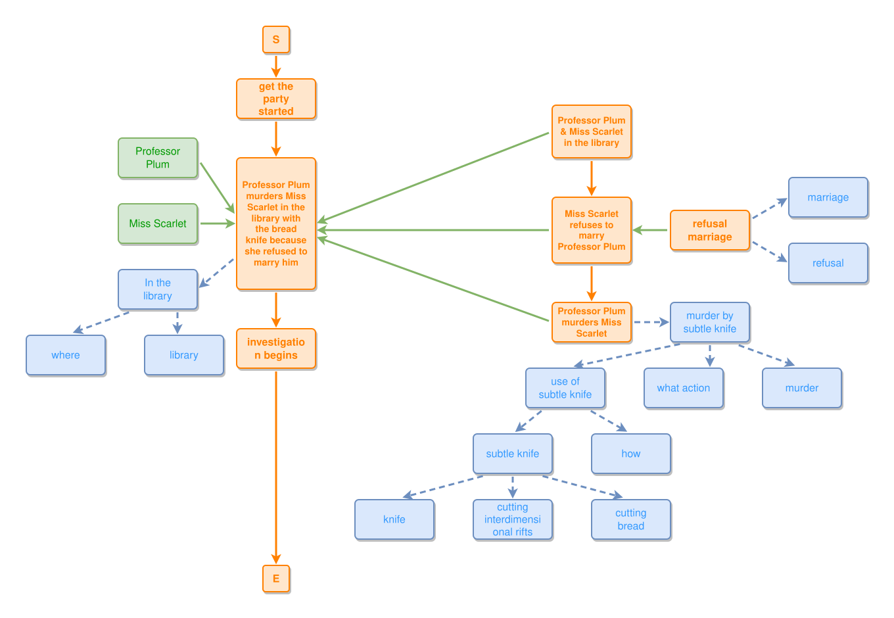
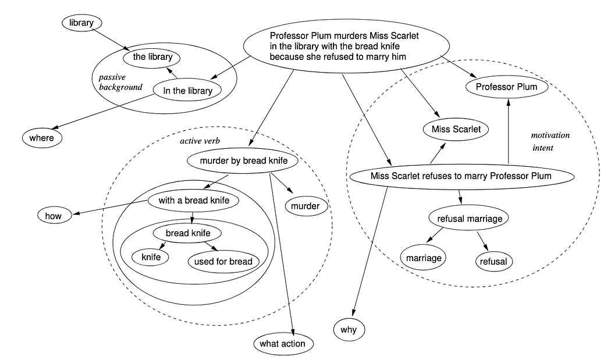

# Murder in the library

A Clue-style narrative modeled in ipmt: a party, a murder, and the investigation that follows. Shows how a top-level event (`murder-e`) decomposes into sub-events via part-of, how the same scene is re-located (`In the library`), and how a weapon's properties are expressed as a chain of concepts.

<!-- ipm-svg id=100 hash=e7860ef2 pos=before -->

```ipmt
get the party started ::e
  --then--> murder-e::a ::e Professor Plum murders Miss Scarlet in the library with the bread knife because she refused to marry him
  --then--> investigation begins ::e

murder-e <--::P involves-- library-ppms::a ::e Professor Plum & Miss Scarlet in the library

# Lifted "In the libray"
murder-e
  --> In the library ::c
  --"answers question"--> where ::c

# Plum and Scarlet also lifted
Professor Plum, Miss Scarlet --> murder-e

# "In the library" is the concept (::c); "library" is the abstract concept it expresses
In the library --"involves"--> library ::c

murder-e <--::P contains-- refusal-mspp::a ::e Miss Scarlet refuses to marry Professor Plum
  <--::P-- refusal-m::a ::e refusal marriage
  --> marriage ::c
refusal-m --> refusal ::c

murder-e <--::P contains-- ppmms::a ::e Professor Plum murders Miss Scarlet

ppmms --"example of"--> murder-sk::a ::c murder by subtle knife
  --"example of"--> use-sk::a ::c use of subtle knife
  --"involves"--> sk::a ::c subtle knife
  --"kind of"--> knife ::c

murder-sk --"answers question"--> what action ::c
murder-sk --"involves"--> murder ::c
use-sk --"answers question"--> how ::c
sk --"used for"--> cutting interdimensional rifts ::c
sk --"used for"--> cutting bread ::c

# leads-to ordering across the three sub-events of the murder
library-ppms --> refusal-mspp --> ppmms

```
> **Syntax note.** This example uses **edge tooltips** - short annotations attached to each arrow, like `--"answers question"-->` and `<--::P involves--`. The intro only teaches the bare arrow forms; edge tooltips are an additional ipmt feature covered in the [ipmt syntax spec](https://github.com/infinite-pm/ipm-tools/blob/main/docs/ipmt-spec.md).
>
> **They are not always drawn.** A tooltip lives in the source; whether it reaches the picture depends on what the preview can do - some renderers put it on the arrow as a label or show it on hover, others (the static SVG on this page included) leave the arrow bare. When an arrow's meaning matters, read it in the ipmt source above, not off the diagram.


**Based on Mark Burgess's murder-scene diagram** in [*Why Semantic Spacetime (SST) is the answer to rescue property graphs*](https://mark-burgess-oslo-mb.medium.com/why-semantic-spacetime-sst-is-the-answer-to-rescue-property-graphs-2c004fe705b2) - Mark Burgess, Aug 17, 2025. The article's argument is that nodes which are just proper names carry no story, so you should *start with events and then break them down* until the pieces answer *where*, *how*, and *why*; the diagram below is Mark's worked example of that advice. The ipmt model above is a transcription of it - same cast (Professor Plum, Miss Scarlet, the library), same three-way breakdown into background, action, and motive - with a party/investigation frame added around the murder and the weapon chain retold as a *subtle knife*.

Murder scenes recur through Mark's knowledge series with a different cast each time: the Cluedo notes in [SSTorytime](https://github.com/markburgess/SSTorytime)'s test data, searched for paths leading out from the victim in [*Using Knowledge Graphs for Inferential Reasoning*](https://mark-burgess-oslo-mb.medium.com/using-knowledge-graphs-for-inferential-reasoning-8a06e583b4d4) (Article 8), and an N4L account of a party that ends badly in [*From Cognition to Understanding*](https://mark-burgess-oslo-mb.medium.com/from-cognition-to-understanding-677e3b7485de) (Article 14).


*"Start with events and then break them down…" - [Mark Burgess's original diagram](burgess-murder-scene.png) from the article above, Aug 17, 2025.*
