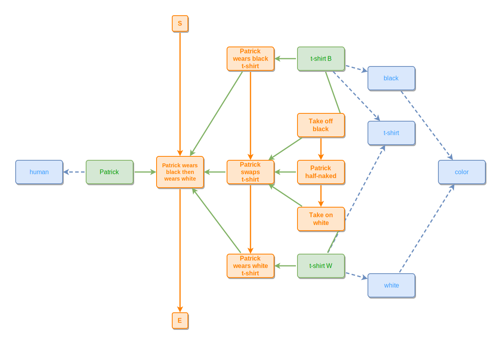
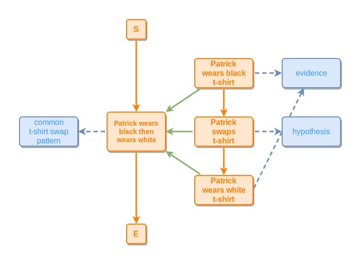
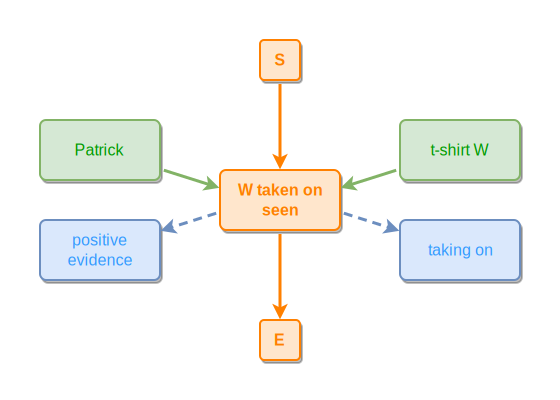
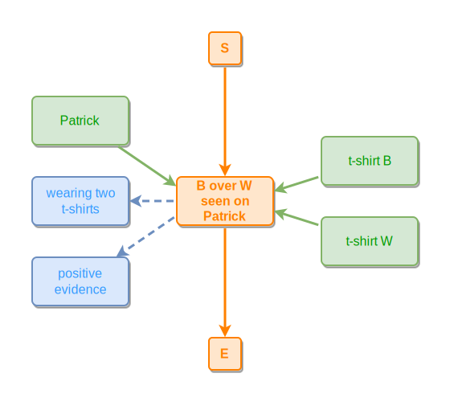
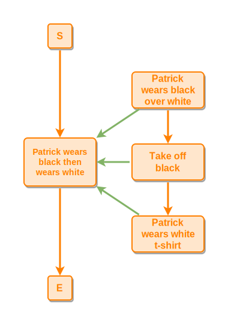
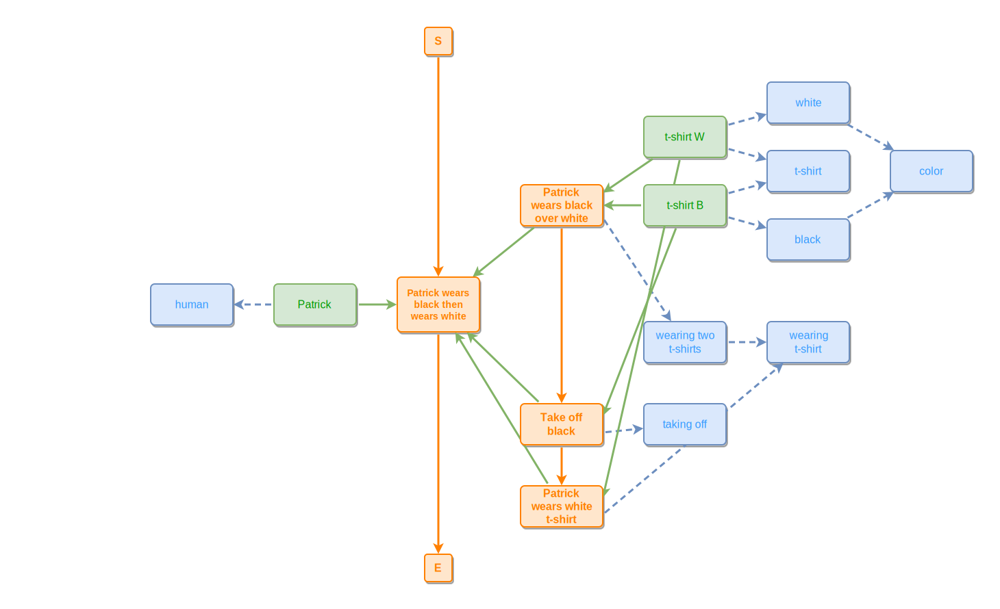
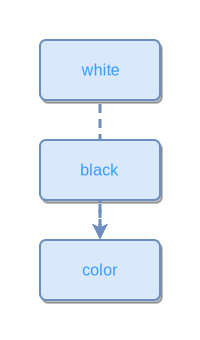
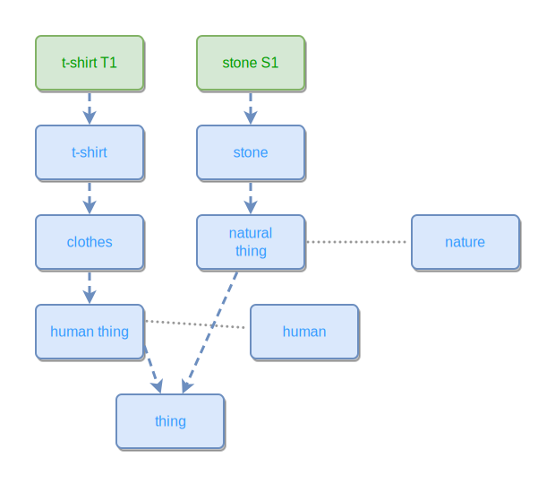

# T-shirt magic

This is the worked-example companion to the [main README](../../README.md). It picks up where the README's Step 4 leaves off and adds two things the intro skipped:

- a **second observer's account** of the same scene — a *layered* variant where the observer saw Patrick wearing black over white, with no take-on of the white t-shirt at all;
- **open-world probe events** — single sightings that decide which observer's account is the one that actually happened.

Note: every ipm graph is an **observer's** account — somebody else watching Patrick, not Patrick's own account. The first model below is told from one chosen viewpoint; further down, we'll see a different observer's account of the same `wearBW` event.

## Recap — the full graph from the README

So the file stands on its own, here is the complete three-level model the README's Step 4 ends with. The top-level `wearBW` event names only the **observable** outcome — Patrick wore black, then he wore white — and stays silent on *how* the change happened. That mechanism is hidden inside the wrapper event; the sub-events reveal it. This observer saw a take-off and take-on (an exchange), so call this **scenario 1: the exchange**. Its discriminating shape is that the two t-shirts are *never simultaneously on Patrick*.

The ipmt source for this graph lives in a sibling file ([`tshirt-magic-recap.ipmt`](tshirt-magic-recap.ipmt)) and is included here via `ipm-include`:

<!-- ipm-include src=tshirt-magic-recap.ipmt -->
<!-- ipm-svg id=01 hash=071a9d36 -->


## Step 1 — event chain with evidence and hypothesis

The README's Step 1 keeps only the two states the observer directly *saw*: Patrick wore a black t-shirt at one moment, then later Patrick wore a white t-shirt. Those two wears are the **evidence**. There is an obvious gap between them — the observer didn't actually witness the moment of change.

A modeler can fill that gap with a **hypothesis**: an event drawn from a shared library of common stories and processes. *"When someone goes from wearing X to wearing Y, something like a swap usually happened in between."* The hypothesized event isn't observed; it's an inference shaped by familiarity with similar past scenes. A future observation can confirm it, contradict it, or replace it with something entirely different (a layered wearing, a costume change, a sleight-of-hand). Patrick himself might tell us what happened, providing direct testimony rather than the observer's inference.

```ipmt
# Parent event — the whole observable story matches a library pattern
Patrick wears black then wears white ::e wearBW::a
wearBW --> common t-shirt swap pattern ::c

# Sub-events: two observed wears + one hypothesized swap, each part-of the parent
Patrick wears black t-shirt ::e wearB::a
  --> Patrick swaps t-shirt ::e swapT::a
  --> Patrick wears white t-shirt ::e wearW::a

wearB --::P--> wearBW
swapT --::P--> wearBW
wearW --::P--> wearBW

# Evidence — directly observed wears
wearB --> evidence ::c
wearW --> evidence ::c

# Hypothesis — the swap is inferred from the library pattern on the parent
swapT --> hypothesis ::c
```
<!-- ipm-svg id=02 hash=68eae702 -->



This is the same three-event chain the README uses from Step 2 onward, but each event now carries the observer's epistemic stance: the `wears` are facts; the `swap` is a guess that fits a familiar process template. From here on, the rest of this file builds on the swap hypothesis the way the README's Step 2+ does — treating it as the model the observer has settled on — while remembering it could be wrong.

## Observation is open-world — positive evidence

Before we draw the alternative scenario, a methodological note. An ipmt observation records what was **seen**, not what was absent — two honest observers can differ without contradicting each other. To decide which scenario actually happened, the observer needs **positive evidence** for one of the discriminating shapes. A single sighting is enough.

Here are two such probe events. The first confirms the **exchange** scenario (the recap above) by catching the white t-shirt being put on — a positive transition that only the exchange contains:

```ipmt
# Confirms scenario 1 (exchange): t-shirt W observed being taken on
W taken on seen ::e probeTakeOnW::a
Patrick    --> probeTakeOnW
t-shirt W  --> probeTakeOnW

# What this observation expresses
probeTakeOnW --> taking on ::c
probeTakeOnW --> positive evidence ::c
```
<!-- ipm-svg id=03 hash=22c262b7 -->



The second confirms the **layered** scenario by catching both t-shirts on Patrick at the same instant — a configuration that only the layered observation contains:

```ipmt
# Confirms scenario 2 (layered): black observed on top of white
B over W seen on Patrick ::e probeBOverW::a
Patrick    --> probeBOverW
t-shirt B  --> probeBOverW
t-shirt W  --> probeBOverW

# What this observation expresses
probeBOverW --> wearing two t-shirts ::c
probeBOverW --> positive evidence ::c
```
<!-- ipm-svg id=04 hash=f88c7d16 -->



Without either probe succeeding, the scenario stays undecided — the honest open-world answer. Note also what we did *not* record: the absence of a take-on does not by itself confirm the layered scenario; we still need the positive `B over W seen` sighting.

## Alternative scenario — layered, in detail

This second observer captured a different sub-event structure under the same top-level `wearBW`. At some moment during it, Patrick was wearing **both** t-shirts at once — black layered over white. The observer never saw a take-on of white; they saw only a take-off of black at the end.

First, the event structure alone — no participants attached yet, so the difference from scenario 1 is plain:

```ipmt
Patrick wears black then wears white ::e wearBW::a

# Mid-level sub-events — wear-layered -> take off black -> wear white
Patrick wears black over white ::e wearLayered::a
  --> Take off black ::e takeOffB::a
  --> Patrick wears white t-shirt ::e wearW::a

wearLayered --::P--> wearBW
takeOffB --::P--> wearBW
wearW --::P--> wearBW
```
<!-- ipm-svg id=05 hash=a4c0b0a7 -->



Same parent `wearBW` as scenario 1; what differs is the mid-level sub-event the observer recorded — `wearLayered` instead of `wearB`, and no `swapT`/`takeOn` pair.

## Alternative scenario — layered, full

Now layer everything in: participants and concepts.

```ipmt
# Top event (same name and alias as scenario 1)
Patrick wears black then wears white ::e wearBW::a

# Mid-level sub-events
Patrick wears black over white ::e wearLayered::a
  --> Take off black ::e takeOffB::a
  --> Patrick wears white t-shirt ::e wearW::a

wearLayered --::P--> wearBW
takeOffB --::P--> wearBW
wearW --::P--> wearBW

# Patrick is present throughout
Patrick --> wearBW
Patrick --> human ::c

# White t-shirt is worn throughout — even underneath the black one in wearLayered
t-shirt W --> wearLayered, wearW

# Black t-shirt is on during the layered wearing and removed in takeOffB
t-shirt B --> wearLayered, takeOffB

# Concepts each event expresses
wearLayered --> wearing two t-shirts ::c
takeOffB    --> taking off ::c
wearW       --> wearing t-shirt ::c

# T-shirt color (thing --> concept)
t-shirt B --> t-shirt ::c, black ::c
t-shirt W --> t-shirt ::c, white ::c

# "Wearing two t-shirts" is a kind of "wearing t-shirt" (concept --> concept)
wearing two t-shirts ::c --> wearing t-shirt ::c

# Color taxonomy
black ::c --> color ::c
white ::c --> color ::c
```
<!-- ipm-svg id=06 hash=eff51647 -->



Call this **scenario 2: the layered observation**. Both scenarios share the top-level `wearBW` event; they differ only in which sub-events the observer recorded, and therefore in which concepts the events express.

## Color taxonomy

White and Black are kinds of Color — a concept-to-concept EXPRESSES relation:

```ipmt
white ::c --> color ::c
black ::c --> color ::c
```
<!-- ipm-svg id=07 hash=78e61ea2 -->



## Thing taxonomies

```ipmt
t-shirt T1 --> t-shirt ::c --> clothes ::c --> human thing ::c
human thing ::c --> thing ::c
human thing ::c --- human ::c

stone S1 --> stone ::c --> natural thing ::c --> thing ::c
natural thing ::c --- nature ::c
```
<!-- ipm-svg id=08 hash=b0cc5788 -->


