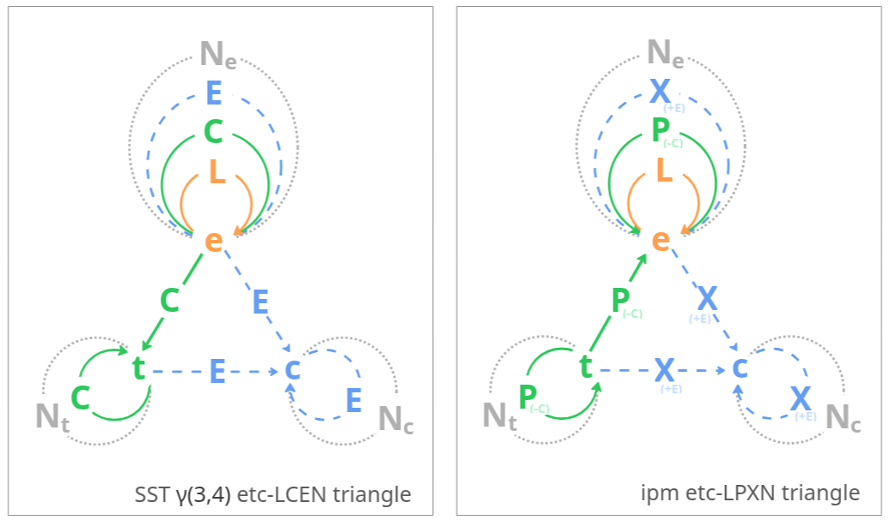

# IPM vs default SST — what we rename

This doc explains the two label changes IPM makes on top of Mark Burgess's original Semantic Spacetime γ(3,4) — and why. For the main IPM modeling introduction, see the [README](../README.md).

IPM is built directly on Mark Burgess's **[Semantic Spacetime γ(3,4)](https://semantic.st/)** ("gamma 3, 4" — three kinds of nodes, four kinds of relations). IPM tweaks two of the original SST labels for readability:

- **C → P, with the direction reversed.** SST's *contains* (`car --C--> engine` — the car spatially encloses the engine) becomes IPM's *part-of* (`engine --P--> car`). Containment in SST is a **spatial** property — a ring drawn around a region, not a generic hierarchy. The graph is the same; we prefer "part-of" because it reads naturally for participation ("Patrick is part of the swap event"), and the arrow then points from the small thing toward its larger spatial container.
- **E → X.** SST's *expresses* relation is shortened to X so that the capital letter for the relation does not collide visually with the lowercase **e** used for an event node. (`E` next to `e` is easy to mis-read; `X` next to `e` is not.)

`L` (leads-to) and `N` (near-to) keep their SST names. So the IPM mnemonic for the four edges becomes **LPXN**, in place of SST's **LCEN**.

## Further reading

- Mark Burgess, [Designing Nodes and Arrows in Knowledge Graphs with Semantic Spacetime](https://mark-burgess-oslo-mb.medium.com/designing-nodes-and-arrows-in-knowledge-graphs-with-semantic-spacetime-0992b9cae595) — the source article for the LCEN triangle.
- The [`semantic.st`](https://semantic.st/) project home for the broader SST framework.
- The [README's "Where to look next" section](../README.md#where-to-look-next) for the full external-reading list.
