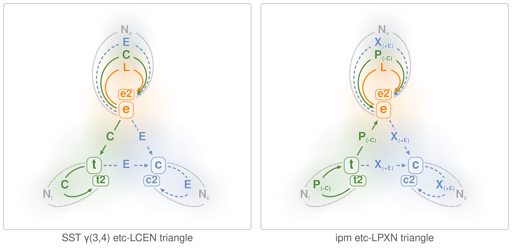

# IPM vs default SST - what we rename

This doc explains the two label changes IPM makes on top of Mark Burgess's original Semantic Spacetime γ(3,4) - and why. For the main IPM modeling introduction, see the [intro](https://infinite.pm/intro/).

IPM is built directly on Mark Burgess's **[Semantic Spacetime γ(3,4)](https://semantic.st/)** ("gamma 3, 4" - three kinds of nodes, four kinds of relations). IPM tweaks two of the original SST labels for readability:

- **C → P, with the direction reversed.** SST's *contains* (`car --C--> engine` - the car spatially encloses the engine) becomes IPM's *part-of* (`engine --P--> car`). Containment in SST is a **spatial** property - a ring drawn around a region, not a generic hierarchy. The graph is the same; we prefer "part-of" because it reads naturally for participation ("Patrick is part of the swap event"), and the arrow then points from the small thing toward its larger spatial container.
- **E → X.** SST's *expresses* relation is shortened to X so that the capital letter for the relation does not collide visually with the lowercase **e** used for an event node. (`E` next to `e` is easy to mis-read; `X` next to `e` is not.)

`L` (leads-to) and `N` (near-to) keep their SST names. So the IPM mnemonic for the four edges becomes **LPXN**, in place of SST's **LCEN**.

Both panels draw a same-kind relation between a corner and a second node of that kind (`e` and `e2`, and so on)
rather than as a loop back to the corner itself: an event that leads to an event leads to a *different* event.
Only the labels and the `C`/`P` arrow direction differ between the two panels; the geometry is identical.

## The skeleton matrix - where the eleven edges come from

Mark states the allowed transitions as a matrix: *Agent Semantics, Semantic Spacetime, and Graphical Reasoning* ([arXiv:2506.07756](https://arxiv.org/abs/2506.07756), June 2025), §4.1 *"Matrices for γ(3,4) skeleton"*, equation 21. Rows are the source node kind, columns the target:

| source → target | → `e` | → `t` | → `c` |
| :-- | :-- | :-- | :-- |
| **`e`** | ±L, ±C, ±E, N_e | +C | +E |
| **`t`** | -C | ±C, N_t | +E |
| **`c`** | -E | -E | ±E, N_c |

The signs are directions, not different relations: `+C` is *contains*, `-C` is the same relation read from the other end, and `N` is undirected. Count each relation once and the matrix gives exactly the eleven edges IPM allows:

- the `e` row: `±L` between events, `±C` for a sub-event inside an event, `±E` for an event expressing an event, `N_e`, then `+C` into a thing and `+E` into a concept;
- the `t` row: `-C` back to the event - the same edge as the event's `+C`, seen from the thing - then `±C` between things, `N_t`, and `+E` into a concept;
- the `c` row: `-E` twice, which are the reverse *readings* of `e → c` and `t → c` rather than edges of their own, plus `±E` and `N_c` among concepts.

So IPM changes the *labels*, never which edges exist: the [eleven combinations](https://infinite.pm/ipm11/maxed.html) are Mark's, one for one.

**This is also what `(-C)` and `(+E)` mean on the triangles above.** IPM's `part-of` is SST's `C` taken in the `-C` direction - from the part towards the whole - and IPM's `expresses` is SST's `E` in its `+E` direction.

## Further reading

- Mark Burgess, [Designing Nodes and Arrows in Knowledge Graphs with Semantic Spacetime](https://mark-burgess-oslo-mb.medium.com/designing-nodes-and-arrows-in-knowledge-graphs-with-semantic-spacetime-0992b9cae595) - the source article for the LCEN triangle.
- The [`semantic.st`](https://semantic.st/) project home for the broader SST framework.
- The [intro's "Where to look next" section](https://infinite.pm/intro/#where-to-look-next) for the full external-reading list.
